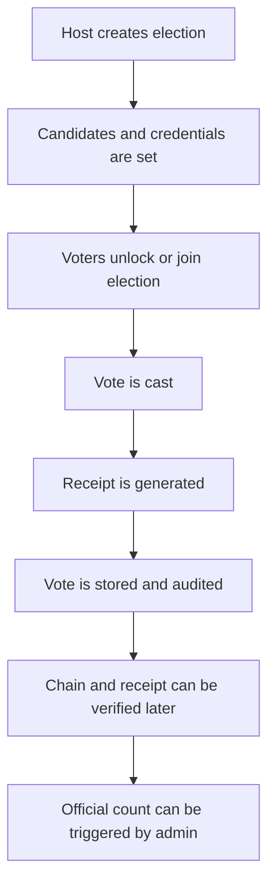

# Castly 

<p align="center">
  <b>Cryptographically backed voting for elections, clubs, colleges, companies, and organizations.</b><br />
  Secure election hosting, tamper detection, vote receipts, and post-election verification in one stack.
</p>

<p align="center">
  <a href="https://castly-sigma.vercel.app">Live Project</a> |
  <a href="#getting-started">Getting Started</a> |
  <a href="#features">Features</a> |
  <a href="#project-structure">Project Structure</a> |
  <a href="#contributing">Contributing</a>
</p>

---

## Overview

VoidX is a full-stack election platform designed to make voting flows easier to launch, easier to verify, and harder to tamper with.

It includes:

- A React frontend for voters and election hosts
- A Django REST backend with role-based flows
- Receipt generation and receipt verification
- Tamper detection and chain verification
- Admin workflows for election setup, control, and counting

The system was initially built as a hackathon project, and then evolved into a broader platform that can be used beyond a single event or competition.

---

## Live Access

| Environment | Link | Notes |
| --- | --- | --- |
| Backend API | [https://castly-backend-r1e0.onrender.com](https://castly-backend-r1e0.onrender.com) | Deployed Django backend on Render |
| Frontend App | _Add your deployed frontend URL here_ | If hosted separately, link it here |

### Common API entry points

- `/api/votes/`
- `/api/audit/`
- `/api/digilocker/`

You can also inspect the backend directly from the deployed base URL:

- [Backend Root](https://castly-backend-r1e0.onrender.com)

---

## Features

### For election hosts

- Host a new election
- Create and manage election candidates
- Set voter and admin credentials
- Start and close elections
- Trigger official counting
- Access per-election admin controls

### For voters

- Join an election with the correct credentials
- Cast a vote securely
- Receive a vote receipt
- Verify the receipt later
- Check whether an election is currently open or locked

### For verification and audit

- Verify the integrity of the vote chain
- Detect tampering attempts
- Restore tamper state in controlled flows
- Validate official count logic
- Inspect stored audit records

### For security and trust

- Cryptographic signing and verification flows
- Receipt-based vote confirmation
- Tamper-aware audit trail
- Session/token-based access for protected actions
- Backend-backed election state management

---

## How It Works



### Typical workflow

1. A host creates an election and configures candidates and access rules.
2. A voter authenticates into the election flow.
3. The voter casts a vote.
4. The backend generates a receipt and stores the vote.
5. The voter can later verify the receipt.
6. The host or admin can verify the chain and run official counting.

---

## Tech Stack

| Layer | Technology |
| --- | --- |
| Frontend | React, Vite, Axios, React Router |
| Backend | Django, Django REST Framework |
| Security / Ops | django-cors-headers, WhiteNoise, Gunicorn |
| Database | PostgreSQL-compatible deployment support |

---

## Getting Started

### Prerequisites

- Node.js 18+ recommended
- Python 3.11+ recommended
- pip
- A PostgreSQL database for production

### Frontend

```bash
cd frontend
npm install
npm run dev
```

### Backend

```bash
cd backend
python -m venv .venv
.venv\Scripts\activate
pip install -r requirements.txt
python manage.py migrate
python manage.py runserver
```

### Environment variables

Backend expects the following environment variables:

| Variable | Purpose |
| --- | --- |
| `SECRET_KEY` | Django secret key |
| `COUNTING_KEY` | Used in election counting / cryptographic flows |
| `ADMIN_TOKEN` | Admin-level token for protected operations |
| `DATABASE_URL` | Preferred production database connection string |
| `CORS_ALLOWED_ORIGINS` | Allowed frontend origins |
| `DEBUG` | Debug mode toggle |

Frontend currently points to the deployed backend in [`frontend/src/api/api.js`](frontend/src/api/api.js). If you want to switch environments, that is the file to update.

---

## API Notes

The frontend consumes the backend through a shared Axios client in:

- [`frontend/src/api/api.js`](frontend/src/api/api.js)

Some important routes exposed by the backend:

| Route | Purpose |
| --- | --- |
| `/api/votes/elections/` | List elections |
| `/api/votes/election/start/` | Create/start an election |
| `/api/votes/cast/` | Cast a vote |
| `/api/votes/verify/<receipt_hash>/` | Verify a receipt |
| `/api/votes/stats/` | Retrieve vote stats |
| `/api/audit/verify-chain/` | Verify audit chain |
| `/api/digilocker/status/` | Session status endpoint |

---

## Project Structure

```text
castly/
├── backend/
│   ├── voidx/          # Django project config (voidx: Hackathon team name)
│   ├── votes/          # Election, voting, and counting logic
│   ├── voters/         # Voter/session-related flows
│   ├── audit/          # Tamper detection and chain verification
│   ├── crypto_utils.py  # Crypto helpers
│   └── manage.py
├── frontend/
│   ├── src/
│   │   ├── api/        # Axios API client
│   │   ├── components/ # Shared UI pieces
│   │   ├── context/    # Auth state
│   │   └── pages/      # App screens
│   └── package.json
└── README.md
```

### Frontend pages

- `Landing` for the public entry point
- `StartElection` for host election setup
- `Vote` for the voting flow
- `Receipt` for receipt lookup and confirmation
- `ChainCheck` for chain verification
- `Admin` for host/admin controls
- `SessionStatus` for session state checks

---

## Deployment

### Backend on Render

The backend is deployed on Render at:

- [https://castly-backend-r1e0.onrender.com](https://castly-backend-r1e0.onrender.com)

Production deployment typically depends on:

- `DATABASE_URL` being set correctly
- `ALLOWED_HOSTS` including the Render hostname
- `CORS_ALLOWED_ORIGINS` including your frontend origin
- Migration state being up to date
- Static files collected for production

### Frontend deployment

If you deploy the frontend separately, point its API layer to the backend base URL used in production.

---

## Testing

Backend tests are included for core flows such as:

- voting flow
- tamper flow
- DigiLocker/session flow

Run backend tests with:

```bash
cd backend
python manage.py test
```

---

## Contributing

Contributions are welcome.

### Good ways to contribute

- Fix bugs in election, receipt, or audit flows
- Improve the UI/UX of voter and host screens
- Add more tests around edge cases
- Improve deployment docs and environment handling
- Strengthen security and validation logic

### Suggested workflow

1. Fork the repository.
2. Create a feature branch.
3. Make focused changes.
4. Run tests locally.
5. Open a pull request with a clear description and screenshots if needed.

### Style guide

- Keep changes small and well-scoped
- Prefer readable, explicit code
- Add tests for behavior changes
- Preserve the security model unless a change is intentionally improving it

---

## Hackathon Origin

VoidX was initially created as a hackathon project for **India Innovates 2026**, where the early version used Aadhaar and DigiLocker-based verification to support candidate and voter validation.

After the hackathon phase, the project was reworked so it could be used by a wider audience beyond that original use case, including:

- college elections
- company elections
- club or society voting
- organizational decision-making

That evolution kept the same core idea: cryptographic trust, auditability, and tamper-resistant election flow, but made the platform more adaptable for real-world use outside the original government hackathon setting.

---

## Roadmap

- Add a polished hosted frontend URL
- Improve documentation for each API endpoint
- Add role-based demo accounts for local testing
- Expand audit dashboards
- Add more automated tests for production edge cases

---

## License

Add your preferred license here if this project will be published publicly.

